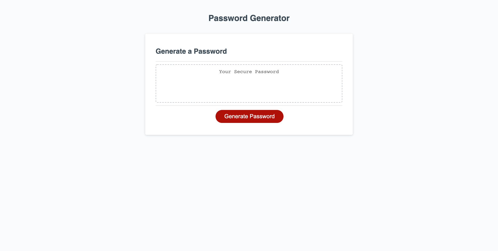

# password-gen
## Description
My goal for this project was to build a password generator that would prompt the user to input a series of criteria they wish the password to have and it would appear on the screen, accordingly.This project was created to test my skills as a programmer and exercise the logical steps necessary to create a random password generator.The main problem I solved was taking in a user's input and using the inputs as a filter to print the desired result. This took a lot of algorithmic planning to accomplish.I learned many things during this project including: prompting users/using inputs, using functions, iterating through arrays, using methods (.random(), .splice(), .push(), .split(), etc...) and merging arrays.
## Installation
[Link to Generator](https://tinastanczyk.github.io/password-gen/)
## Usage

## Credits
Not Applicable
## License
[Link to License](LICENSE)
